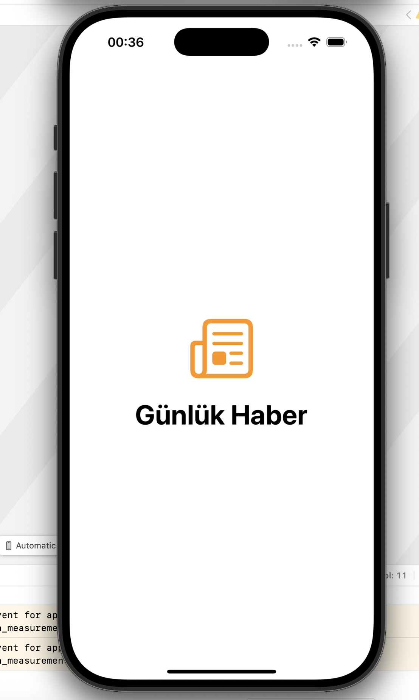
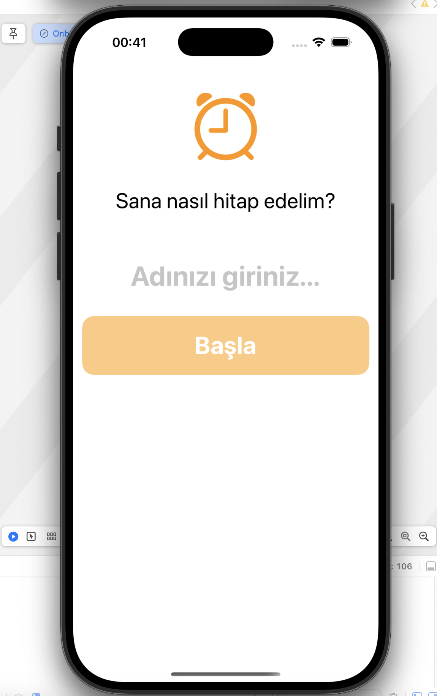
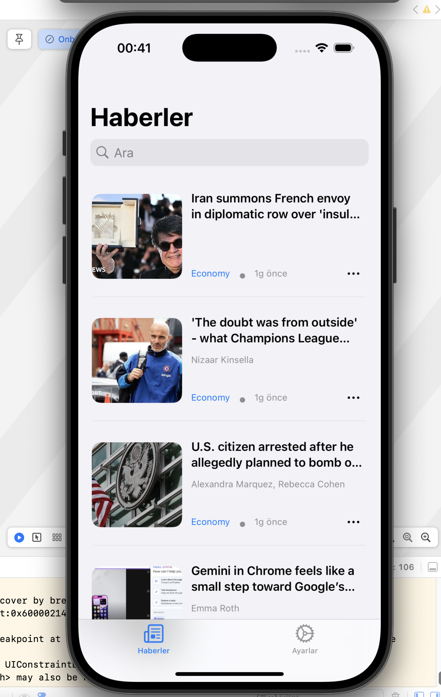
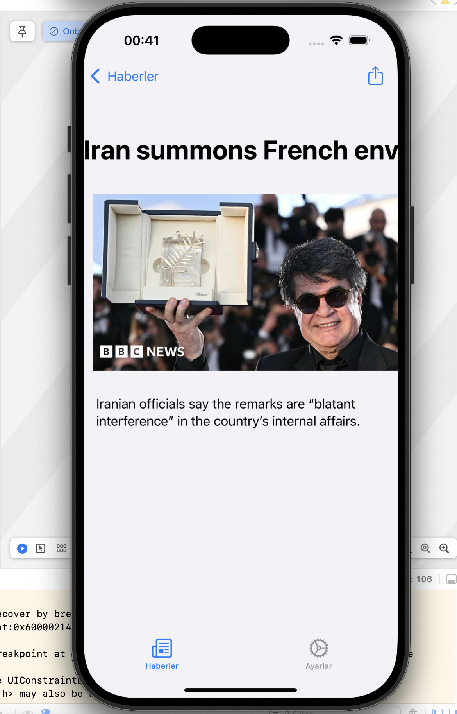
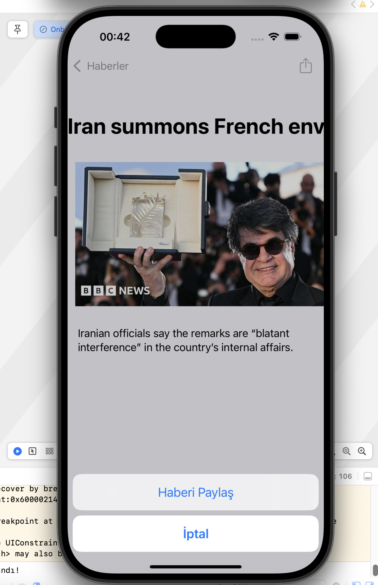
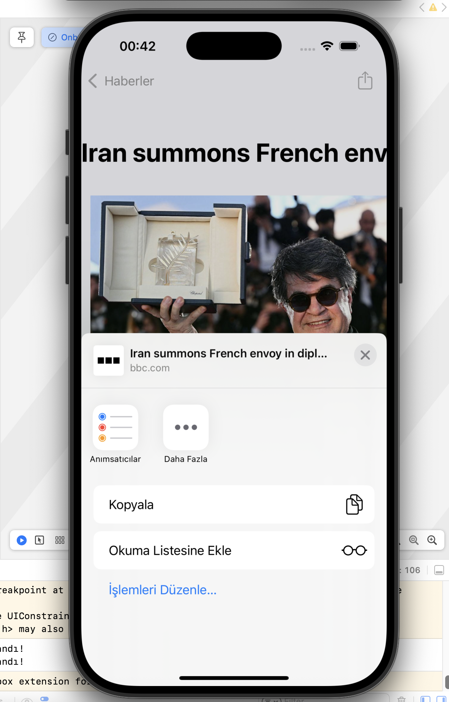
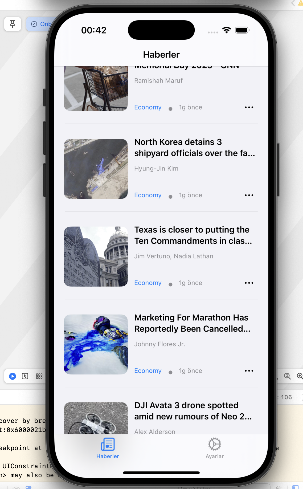
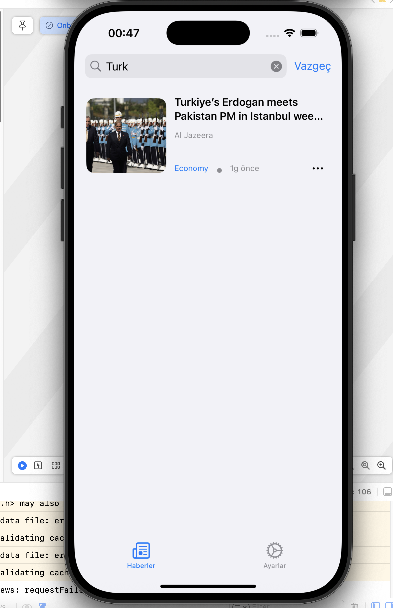
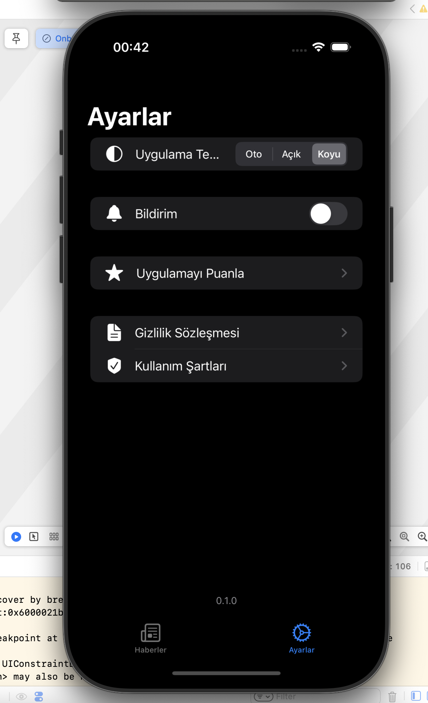
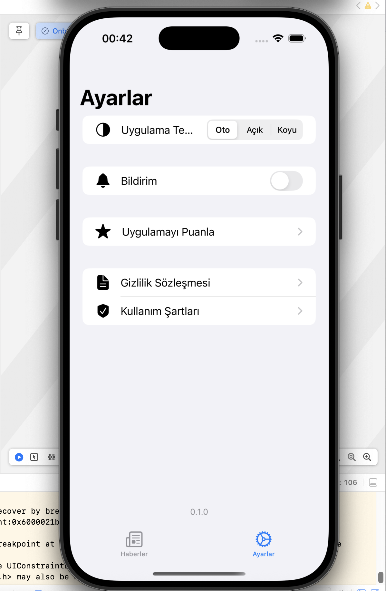

# 📱 NewsApp – Swift UIKit Haberler Uygulaması

NewsApp, REST API ile haberleri listeleyen, arama yapılabilen, paylaşılabilen ve kullanıcı tercihlerini yöneten modern bir iOS uygulamasıdır. UIKit, MVVM Protocol-Oriented mimari, Coordinator Pattern ve UserDefaults gibi modern iOS geliştirme yaklaşımlarını kullanır.

## ✨ Özellikler

- 🔗 **REST API ile Haber Listeleme**
- 📦 **Pagination** (Sonsuz Kaydırma)
- 🔍 **Haberlerde Arama**
- 📤 **Haber Paylaşma** (iOS paylaşım sayfası ile)
- 🖼️ **Kingfisher ile Görsel Yükleme ve Önbellekleme**
- 🗂️ **MVVM + Coordinator + Protocol-Oriented Architecture**
- 🌐 **Localization Desteği** (Türkçe 🇹🇷 ve İngilizce 🇬🇧)
- 💾 **UserDefaults ile Kullanıcı Tercihlerini Kaydetme**
- 🎨 **Dinamik Tema Değiştirme** (Açık / Koyu Tema)
- 🔔 **Bildirim İzni Alma ve Tercihlere Bağlı Bildirim Ayarı**
- 🔁 **Splash ve Onboarding Ekranı**
- ⚠️ **Network Hatalarının Yönetimi (Error Handling)**
- 🧩 **Generic Veri Modelleri**

## 🧱 Mimari

Proje, sürdürülebilirlik ve test edilebilirliği artırmak amacıyla aşağıdaki mimari prensipleri takip eder:

- `MVVM` + `Coordinator Pattern`
- `Protocol-Oriented` yaklaşımı
- `UserDefaults` ile basit veri saklama
- Ayrık katmanlar (View, ViewModel, Coordinator, Service, Model)
- `Dependency Injection` ile ViewModel ve Servislerin yönetimi

## 📸 Ekran Görüntüleri

| Splash | Onboarding | News |
|-------|------------|------|
|   |   |  |

| News Detail | Share | Share Finalize |
|-------------|-------|----------------|
|   |   |   |

| Pagination | Search | Theme Change |
|------------|--------|--------------|
|  |   |   |

| Settings |
|----------|
|  |
## ⚙️ Kullanıcı Ayarları

- Uygulama temasını açık/koyu olarak ayarlayabilirsiniz.
- Bildirim almak isteyen kullanıcılar, uygulama içinden izin vererek bu özelliği aktif hale getirebilir.

## 🌍 Localization

Uygulama hem **Türkçe** hem de **İngilizce** dil desteği sunar. Sistem dili değiştikçe içerikler otomatik olarak uyum sağlar.

## 📡 Network

- REST API ile veri çekimi
- `URLSession` bazlı servis yapısı
- `Generic` veri modeli
- Gelişmiş `Error Handling`
  
## 🖼️ Görsel Yönetimi

Uygulama içindeki haber görselleri [Kingfisher](https://github.com/onevcat/Kingfisher) kütüphanesi kullanılarak asenkron bir şekilde yüklenir ve önbelleğe alınır.

```swift
import Kingfisher

imageView.kf.setImage(with: URL(string: imageUrl))

## 🚀 Kurulum

1. Bu repoyu klonlayın:
   ```bash
   git clone https://github.com/MeliksahSelvi/news-swift.git
